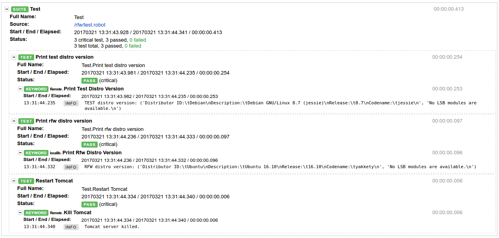

# Control containerized app from other containerized app

## Preconditions:
1. Install docker according to [documentation](https://docs.docker.com/engine/installation/)
2. Install docker-compose according to [documentation](https://docs.docker.com/compose/install/)
3. Clone the repo from github
4. Enter to the directory `control_docker_from_docker`

We will assume that our System Under Test (SUT) is run using Tomcat. Therefore we will 
use tomcat docker image as our SUT image that we will use to build *test* image.

## How-to
1. Bring up `test` image (based on SUT image) and image with Robotframework (`rfw`)
by executing:

```bash
$ docker-compose up 
```

This will build and pull all needed images (if needed), start them and bond in network.
You can check containers are running by executing (in the dir where yml file
is located):

```bash
$ docker-compose ps
             Name                     Command        State   Ports 
------------------------------------------------------------------
controldockerfromdocker_rfw_1    tail -f /dev/null   Up            
controldockerfromdocker_test_1   /test/run_all.sh    Up
```

You can also visit `localhost:8080` page to see tomcat's start page.

2. Enter to `test` container and check if XML-RPC server is running:

```bash
$ docker exec -it controldockerfromdocker_test_1 bash
# python -m robotremoteserver test
Remote server running at http://127.0.0.1:8270.
```

3. Exit `test` container and enter the `rfw` container and execute tests:

```bash
$ docker exec -it controldockerfromdocker_rfw_1 bash
# cd  /rfw/
# robot test.robot 
==============================================================================
Test                                                                          
==============================================================================
Print test distro version                                             | PASS |
------------------------------------------------------------------------------
Print rfw distro version                                              | PASS |
------------------------------------------------------------------------------
Restart Tomcat                                                        | PASS |
------------------------------------------------------------------------------
Test                                                                  | PASS |
3 critical tests, 3 passed, 0 failed
3 tests total, 3 passed, 0 failed
==============================================================================
Output:  /rfw/output.xml
Log:     /rfw/log.html
Report:  /rfw/report.html
```

You can see that 3 test cases were executed.

4. Exit `rfw` container and copy test report to the host in order to view it in
a browser:

```bash
$ docker cp controldockerfromdocker_rfw_1:/rfw/log.html .
```



you can see that both "Print ..." test cases printed different Linux
distribution info. `RFW` container is based on Ubuntu and SUT/`Test`
(the one with tomcat) is based on Debian.
If you run on the host `docker ps` before test execution you will see
in the command output that both containers has been launched at the same time:

```bash
$ docker ps
CONTAINER ID        IMAGE                          COMMAND               CREATED             STATUS              PORTS               NAMES
2e67cac31be4        controldockerfromdocker_test   "/test/run_all.sh"    4 minutes ago       Up 4 minutes                            controldockerfromdocker_test_1
91ac8e4716cf        controldockerfromdocker_rfw    "tail -f /dev/null"   4 minutes ago       Up 4 minutes                            controldockerfromdocker_rfw_1
```

But after executing test case you may notice that `test` container
was freshly started:

```bash
$ docker ps
CONTAINER ID        IMAGE                          COMMAND               CREATED             STATUS              PORTS               NAMES
2e67cac31be4        controldockerfromdocker_test   "/test/run_all.sh"    5 minutes ago       Up 4 seconds                            controldockerfromdocker_test_1
91ac8e4716cf        controldockerfromdocker_rfw    "tail -f /dev/null"   5 minutes ago       Up 5 minutes                            controldockerfromdocker_rfw_1
```

5. You can now stop and remove (option --remove-orphans) all containers:

```bash
docker-compose down --remove-orphans
Stopping controldockerfromdocker_test_1 ... done
Stopping controldockerfromdocker_rfw_1 ... done
Removing controldockerfromdocker_test_1 ... done
Removing controldockerfromdocker_rfw_1 ... done
```

## Summary

Robotframework's Remote library with XML-RPC server are the answers to the
question how to control dockerized application from within other dockerized
application. Using this approach you can achieve much more:

* block network traffic on interfaces/ports
* create files
* control processes currently running in a container
* and many, many more
